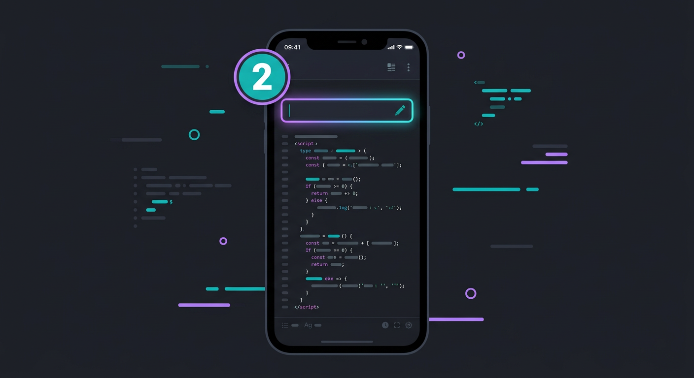
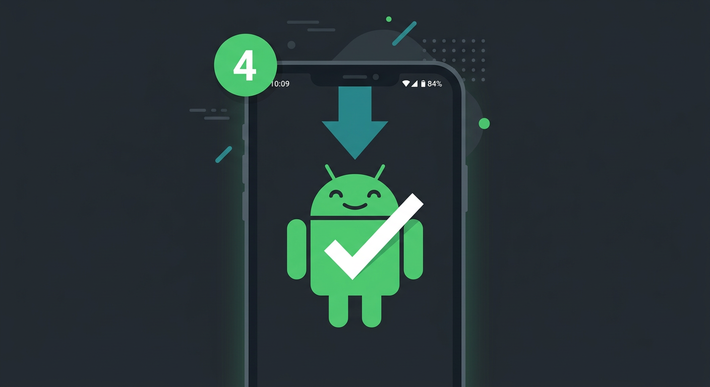

# Android APK — phone se banane ki mukammal tasveeri guide

Sirf phone chahiye. Koi computer, koi JDK, koi Android Studio **nahi**. Poora build
GitHub ke servers pe hota hai, aur aap APK download karke install kar lete ho.

> **Ek line mein:**
> **1** PR merge → **2** file ka naam badlo → **3** Actions mein Run → **4** APK install

Har step ki tasveer isi folder mein hai. Neeche har step ke exact taps likhe hain.

---

## Step 1 — Pull Request merge karo


1. GitHub app / browser mein apna repo kholo: `abdurrehman6384-web/automatic-journey`
2. **Pull requests** tab → **#1** kholo.
3. Neeche hara **Merge pull request** button dabao → confirm.

**Kya hoga:** saara code (android-control, android-app, android-agent) `main` pe
aa jayega — jis mein `android-agent/pet/build-apk-ci.yml` bhi shamil hai.

**Agar button dikhe hi nahi:** page refresh karo; PR already merged ho chuki ho to
"This pull request was merged" likha hoga — aage barho.

---

## Step 2 — Workflow file ko sahi jagah rakho



GitHub sirf `<repo>/.github/workflows/` ke andar se build chalaata hai. Meri file
abhi `android-agent/pet/build-apk-ci.yml` pe hai, isliye usse **rename** karna hai.
Paste ki zaroorat nahi — bas naam badlo.

1. Repo mein **Code** tab → `android-agent` → `pet` → **`build-apk-ci.yml`** kholo.
2. Upar daayen **pencil (✎)** icon dabao (edit).
3. Sabse upar jo **filename** ka box hai, usmein pura path likho:
   ```
   .github/workflows/build-apk.yml
   ```
   (GitHub khud folder bana dega.)
4. Neeche **Commit changes** dabao → **Commit to main**.

**Kyun ye kaam karta hai:** file ko `.github/workflows/` mein *bot* nahi daal sakta
(GitHub usse `workflows` permission nahi deta), lekin **aap** web-editor se daal
sakte ho — web editor aapki apni permissions use karta hai.

---

## Step 3 — Actions mein workflow chalao


1. Repo mein **Actions** tab kholo. Ab list mein **"Build APK (OpenDroid + Toni)"**
   dikhega (pehle wala "Get started" page ab nahi aayega).
2. Uspe tap karo → daayen **Run workflow** button dabao → confirm.
3. Ek nayi run shuru hogi. Tap karke kholo — **5 se 8 minute** lagte hain.

**Kya ho raha hai andar:** GitHub ka runner OpenDroid clone karta hai, Toni pet
daalta hai, patch lagata hai, JDK 21 + Android SDK se build karta hai. Aapko kuch
install nahi karna — runner pe SDK pehle se hai.

**Agar run fail ho:** neeche wali "Agar kuch galat ho jaye" section dekho.

---

## Step 4 — APK download karke install karo



1. Run **green (success)** hote hi, page ke neeche **Artifacts** section kholo.
2. **`toni-debug-apk`** pe tap karo → `app-debug.apk` download hogi.
3. Phone pe file kholo → **Install** → agar poochhe to "Unknown sources allow" karo.

**Ab app chalao:**
1. **OpenDroid** app kholo.
2. **Settings → Accessibility → OpenDroid** → enable karo.
3. App ke andar **floating button** ki setting on karo.
4. **Toni** screen ke right edge pe aa jayegi — idle mein saans leti hai, sochne pe
   upar dekhti hai, bolte pe mouth chalti hai, error pe kaan neeche.

**APK ko PC pe install karna ho:**
```
adb install -r app-debug.apk
```

---

## Agar kuch galat ho jaye (troubleshooting)

| Masla | Hal |
|---|---|
| Actions mein workflow nahi dikhta | Step 2 adhoora hai — confirm karo file **`.github/workflows/build-apk.yml`** pe hai, aur `main` branch pe hai |
| Run fail: "SDK / licence" error | Runner config ka masla — run ke log mein dekho; usually dobara Run karne se theek ho jaata hai |
| Run fail: patch anchor not found | OpenDroid ne code badla hoga. `android-agent/pet/APPLY.md` dekhe ya mujhe batayein |
| APK install nahi hoti | Settings → "Install unknown apps" allow karo |
| Toni nahi dikhti | Accessibility service + floating setting dono on karo |

---

## Computer wala raasta (agar PC mile)

```bash
git clone https://github.com/abdurrehman6384-web/automatic-journey.git
cd automatic-journey
android-agent/pet/build-apk.sh           # debug APK
android-agent/pet/build-apk.sh --release # signed release (keystore chahiye)
```

`build-apk.sh` khud JDK-21 check, SDK detect, Toni install, patch, build aur sha256
sab sambhal leta hai. Output: `opendroid/app/build/outputs/apk/debug/app-debug.apk`.

---

## Tasveeron ki had

Ye tasveeron **illustration** hain — exact button ka rang/position aapke GitHub
version mein thoda alag ho sakta hai. Asli strings (Merge pull request, pencil,
Run workflow, Artifacts, toni-debug-apk) upar likhi hain; tasveer sirf raasta
dikhane ke liye hai.
